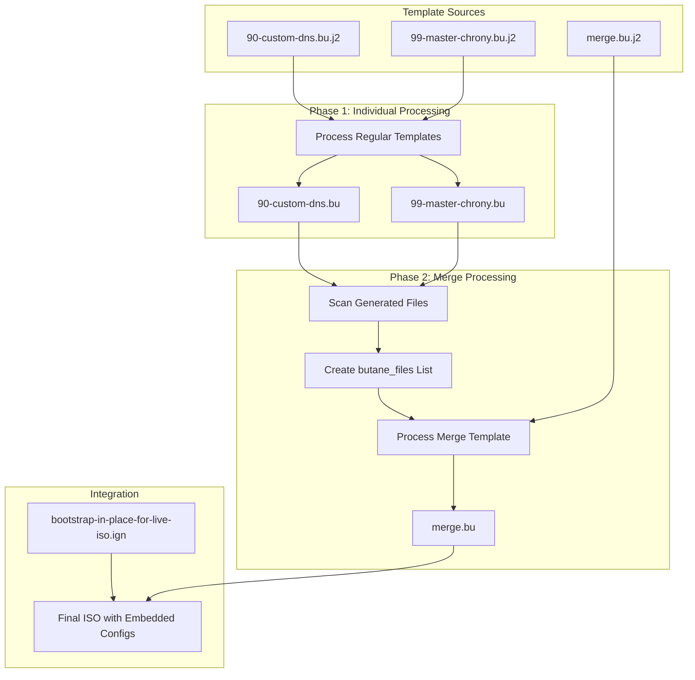
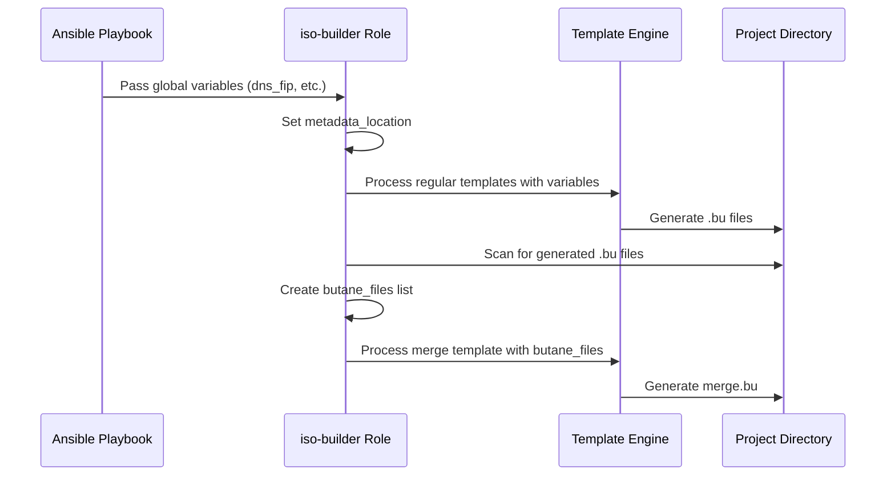

# Butane Template Processing Workflow

## Overview

The PSI-SNO project implements an advanced Butane template processing system that enables dynamic generation and merging of OpenShift machine configurations. This system processes Jinja2-templated Butane files in a two-phase approach to create a unified configuration that gets embedded into OpenShift installation ISOs.

## Architecture

### Two-Phase Processing

The workflow consists of two distinct phases that run sequentially:

1. **Phase 1 - Individual Template Processing**
   - Process regular Butane templates (`.bu.j2` files)
   - Generate individual `.bu` configuration files
   - Store results in the project directory

2. **Phase 2 - Merge Template Processing**
   - Scan for generated `.bu` files
   - Process merge templates with dynamic file lists
   - Generate unified `merge.bu` configuration

### Component Overview



## Directory Structure

### Template Organization

```
psi-sno/
├── configs/openshift/machine-configs/butane/
│   ├── 90-custom-dns.bu.j2      # DNS configuration template
│   ├── 99-master-chrony.bu.j2   # Time synchronization template
│   └── merge.bu.j2               # Merge coordination template
├── build/projects/{project_name}/
│   ├── bootstrap-in-place-for-live-iso.ign  # OpenShift bootstrap
│   ├── 90-custom-dns.bu                     # Generated config
│   ├── 99-master-chrony.bu                  # Generated config
│   ├── merge.bu                             # Unified config
│   └── {project_name}.iso                   # Final ISO
└── build/generated/
    ├── *.bu                      # Alternative output location
    └── *.ign                     # Converted Ignition files
```

### Template Naming Convention

Templates follow a systematic naming pattern:

- **Priority Prefix**: `90-`, `99-` (processing order)
- **Function Name**: `custom-dns`, `master-chrony` (descriptive)
- **Template Extension**: `.bu.j2` (Butane + Jinja2)

## Implementation Details

### Ansible Role Structure

The functionality is implemented in the `openshift/iso-builder` role:

```
roles/openshift/iso-builder/
├── tasks/
│   ├── main.yml                    # Entry point with tag filtering
│   ├── make_iso.yml               # ISO creation with template processing
│   ├── gen_machineconfig.yml      # Standalone template processing
│   └── process_single_template.yml # Individual template handler
├── defaults/main.yml              # Default variables
└── README.md                      # Role documentation
```

### Key Tasks Implementation

#### Template Discovery and Separation

```yaml
- name: Find all Butane template files (.j2)
  ansible.builtin.find:
    paths: "{{ playbook_dir }}/../configs/openshift/machine-configs/butane"
    patterns: "*.j2"
  register: butane_template_files

- name: Separate merge template from other templates
  ansible.builtin.set_fact:
    regular_templates: "{{ butane_template_files.files | rejectattr('path', 'match', '.*merge\\.bu\\.j2$') | list }}"
    merge_templates: "{{ butane_template_files.files | selectattr('path', 'match', '.*merge\\.bu\\.j2$') | list }}"
```

#### Phase 1: Regular Template Processing

```yaml
- name: Process regular Butane templates first
  ansible.builtin.template:
    src: "{{ template_file.path }}"
    dest: "{{ metadata_location }}/{{ template_file.path | basename | regex_replace('\\.j2$', '') }}"
    mode: '0644'
  loop: "{{ regular_templates | default([]) }}"
  loop_control:
    loop_var: template_file
```

#### Phase 2: Merge Template Processing

```yaml
- name: Find generated .bu files in project directory
  ansible.builtin.find:
    paths: "{{ metadata_location }}"
    patterns: "*.bu"
  register: generated_bu_files

- name: Create list of .bu filenames for merge template
  ansible.builtin.set_fact:
    butane_files: "{{ generated_bu_files.files | map(attribute='path') | map('basename') | list }}"

- name: Process merge Butane templates
  ansible.builtin.template:
    src: "{{ template_file.path }}"
    dest: "{{ metadata_location }}/{{ template_file.path | basename | regex_replace('\\.j2$', '') }}"
    mode: '0644'
  loop: "{{ merge_templates | default([]) }}"
```

## Template Examples

### Individual Configuration Template

**File**: `configs/openshift/machine-configs/butane/90-custom-dns.bu.j2`

```yaml
variant: openshift
version: 4.18.0
metadata:
  name: 90-master-dns
  labels:
    machineconfiguration.openshift.io/role: master
storage:
  files:
    - path: /etc/NetworkManager/conf.d/90-custom-dns.conf
      mode: 0644
      overwrite: true
      contents:
        inline: |
          [main]
          dns={{ dns_fip }}
```

### Merge Coordination Template

**File**: `configs/openshift/machine-configs/butane/merge.bu.j2`

```yaml
# merge.bu
variant: openshift
version: 4.18.0
ignition:
  config:
    merge:
      - source: file://{{ metadata_location }}/bootstrap-in-place-for-live-iso.ign

      - local: {{ bu_file }}

```

### Generated Output Example

**File**: `build/projects/psi-example/merge.bu` (generated)

```yaml
# merge.bu
variant: openshift
version: 4.18.0
ignition:
  config:
    merge:
      - source: file:///path/to/project/bootstrap-in-place-for-live-iso.ign
      - local: 90-custom-dns.bu
      - local: 99-master-chrony.bu
```

## Variable Management

### Required Variables

| Variable | Scope | Description | Example |
|----------|-------|-------------|---------|
| `metadata_location` | Global | Project directory path | `/path/to/build/projects/psi-example` |
| `butane_files` | Merge phase | List of generated .bu files | `["90-custom-dns.bu", "99-master-chrony.bu"]` |
| `dns_fip` | DNS templates | DNS server IP address | `10.0.108.151` |
| `project_name` | Global | Current project identifier | `psi-example` |

### Variable Lifecycle



## Usage Patterns

### Full ISO Creation

```bash
# Complete workflow including template processing
make create-iso

# With specific project (bypasses interactive selection)
make create-iso PROJECT=psi-example
```

### Standalone Template Processing

```bash
# Process only Butane templates
ansible-playbook playbooks/gen-machineconfig.yml

# With verbose output for debugging
ansible-playbook -vvv playbooks/gen-machineconfig.yml
```

### Manual Template Testing

```bash
# Test individual template
ansible localhost -m template \
  -a "src=configs/openshift/machine-configs/butane/90-custom-dns.bu.j2 dest=./test.bu" \
  -e "dns_fip=10.0.108.151"

# Test merge template
ansible localhost -m template \
  -a "src=configs/openshift/machine-configs/butane/merge.bu.j2 dest=./merge.bu" \
  -e "metadata_location=$(pwd)" \
  -e '{"butane_files": ["90-custom-dns.bu", "99-master-chrony.bu"]}'
```

## Error Handling and Troubleshooting

### Common Error Scenarios

#### Template Not Found

**Error**: `Skipped '/path/to/butane' path due to this access issue: not a directory`

**Cause**: Incorrect template directory path

**Solution**: Verify path in role defaults:
```yaml
butane_templates_dir: "{{ (playbook_dir ~ '/../configs/openshift/machine-configs/butane') | realpath }}"
```

#### Undefined Variable

**Error**: `'regular_templates' is undefined`

**Cause**: Template separation logic failed

**Solution**: Check template discovery and add defaults:
```yaml
regular_templates: "{{ butane_template_files.files | rejectattr('path', 'match', '.*merge\\.bu\\.j2$') | list | default([]) }}"
```

#### Recursive Template Error

**Error**: `recursive loop detected in template string`

**Cause**: Self-referential variable definition

**Solution**: Remove recursive variable assignments:
```yaml
# ❌ Wrong - causes recursion
vars:
  butane_files: "{{ butane_files | default([]) }}"

# ✅ Correct - use direct assignment
butane_files: "{{ generated_bu_files.files | map(attribute='path') | map('basename') | list }}"
```

### Debugging Techniques

#### Enable Verbose Output

```bash
ansible-playbook -vvv playbooks/create-iso.yml
```

#### Check Generated Files

```bash
ls -la build/projects/*/
find build/projects/ -name "*.bu" -exec cat {} \;
```

#### Validate Template Syntax

```bash
# Check Jinja2 syntax
ansible-playbook --syntax-check playbooks/gen-machineconfig.yml

# Test template variables
ansible localhost -m debug -a "var=dns_fip"
```

#### Monitor Variable Values

```yaml
- name: Debug template processing variables
  ansible.builtin.debug:
    msg:
      - "metadata_location: {{ metadata_location }}"
      - "butane_files: {{ butane_files | default('undefined') }}"
      - "regular_templates count: {{ regular_templates | default([]) | length }}"
      - "merge_templates count: {{ merge_templates | default([]) | length }}"
```

## Best Practices

### Template Design

1. **Use meaningful prefixes**: Priority-based naming (90-, 99-)
2. **Single responsibility**: One configuration concern per template
3. **Variable validation**: Check required variables in templates
4. **Documentation**: Include comments explaining template purpose

### Variable Management

1. **Define defaults**: Provide fallback values where possible
2. **Validate inputs**: Check variable types and formats
3. **Scope properly**: Use appropriate variable scope (global, role, task)
4. **Document requirements**: Clearly specify required variables

### Error Prevention

1. **Test templates**: Validate before deployment
2. **Use conditionals**: Handle missing variables gracefully
3. **Monitor processing**: Watch for warnings and errors
4. **Version control**: Track template changes

### Performance Optimization

1. **Minimize loops**: Use efficient Jinja2 constructs
2. **Cache results**: Avoid redundant processing
3. **Parallel processing**: Leverage Ansible parallelism where possible
4. **Resource cleanup**: Remove temporary files when appropriate

## Integration Points

### OpenShift Integration

The generated configurations integrate with OpenShift through:

- **Machine Config Operator**: Applies configurations to cluster nodes
- **Ignition**: Processes configurations during node bootstrap
- **Bootstrap Process**: Merges with OpenShift installer-generated configs

### CI/CD Integration

Template processing can be integrated into CI/CD pipelines:

```yaml
# Example GitLab CI stage
test-butane-templates:
  stage: test
  script:
    - ansible-playbook --syntax-check playbooks/gen-machineconfig.yml
    - ansible-playbook -C playbooks/gen-machineconfig.yml  # Dry run
```

### Monitoring and Validation

Post-deployment validation can verify configuration application:

```bash
# Check applied machine configs
oc get machineconfigs

# Verify DNS configuration on nodes
oc debug node/worker-node -- chroot /host cat /etc/NetworkManager/conf.d/90-custom-dns.conf
```

## Future Enhancements

### Potential Improvements

1. **Template Validation**: Pre-deployment syntax checking
2. **Configuration Drift Detection**: Monitor for manual changes
3. **Template Dependencies**: Handle inter-template dependencies
4. **Conditional Processing**: Skip templates based on cluster configuration
5. **Multi-Environment Support**: Environment-specific template variations

### Extensibility

The workflow can be extended to support:

- Additional configuration types (networking, storage, security)
- Multi-cluster deployments
- Configuration rollback capabilities
- Integration with external configuration management systems

## References

- [Butane Configuration Specification](https://coreos.github.io/butane/config-openshift-v4_16/)
- [OpenShift Machine Configuration](https://docs.openshift.com/container-platform/latest/post_installation_configuration/machine-configuration-tasks.html)
- [Fedora CoreOS Ignition](https://docs.fedoraproject.org/en-US/fedora-coreos/producing-ign/)
- [Ansible Template Module](https://docs.ansible.com/ansible/latest/collections/ansible/builtin/template_module.html)