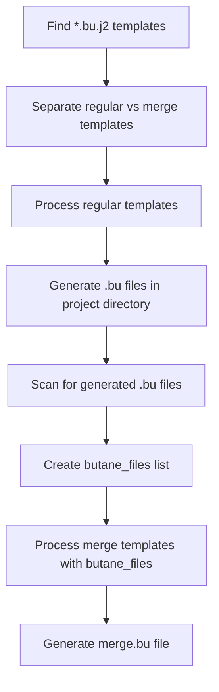

# Documentation Updates Summary

## Overview

This document summarizes the comprehensive documentation updates made to reflect the recent Butane template processing enhancements implemented in the PSI-SNO project.

## Files Updated

### 1. Project Cursor Rules (`.cursorrules`)

**File**: `.cursorrules`
**Changes**: Enhanced with Butane template processing documentation

#### New Sections Added:

- **Butane Template Processing Overview**: Complete workflow explanation
- **Template Locations**: Directory structure and file organization
- **Processing Workflow**: Two-phase processing explanation
- **Key Files Generated**: Output file descriptions
- **Enhanced Troubleshooting**: New troubleshooting scenarios for template processing

#### Key Additions:

```yaml
## Butane Template Processing

### Template Locations
- **Templates**: `configs/openshift/machine-configs/butane/*.bu.j2`
- **Generated files**: Project directory (`build/projects/{project_name}/`)
- **Examples**: `90-custom-dns.bu.j2`, `99-master-chrony.bu.j2`, `merge.bu.j2`

### Processing Workflow
**Two-Phase Processing:**
1. **Regular templates** → Generate individual `.bu` files in project directory
2. **Merge template** → Combine bootstrap ignition + all `.bu` files into `merge.bu`
```

### 2. ISO Builder Role Documentation

**File**: `roles/openshift/iso-builder/README.md`
**Changes**: Comprehensive workflow documentation added

#### New Sections Added:

- **Enhanced Features List**: Two-phase processing and merge functionality
- **Variable Documentation**: ISO creation and template processing variables
- **Complete Workflow Section**: Detailed processing flow with Mermaid diagrams
- **Template Examples**: Real-world template and output examples
- **Processing Flow Diagram**: Visual representation of the workflow

#### Key Additions:

```yaml
## Butane Template Processing Workflow

### Processing Flow


### 3. Knowledge Base Documentation

**File**: `knowledge/merge-ignition.md`
**Changes**: Complete rewrite with PSI-SNO specific implementation

#### Content Overview:

- **Background**: Ignition merge capabilities and limitations
- **PSI-SNO Implementation**: Detailed architecture explanation
- **Template Structure**: File organization and naming conventions
- **Processing Workflow**: Step-by-step process documentation
- **Variable Management**: Required variables and validation
- **Usage Examples**: Manual and automated processing examples
- **Best Practices**: Template design and error prevention
- **Troubleshooting**: Common issues and debugging techniques

### 4. Comprehensive Workflow Documentation

**File**: `docs/butane-template-processing.md` (New)
**Changes**: Created comprehensive technical documentation

#### Content Sections:

- **Architecture Overview**: Two-phase processing explanation
- **Component Diagrams**: Mermaid diagrams showing data flow
- **Implementation Details**: Ansible role structure and task implementation
- **Template Examples**: Complete template files with explanations
- **Variable Management**: Lifecycle and scope documentation
- **Error Handling**: Comprehensive troubleshooting guide
- **Best Practices**: Design patterns and optimization techniques
- **Integration Points**: OpenShift and CI/CD integration
- **Future Enhancements**: Extensibility and improvement opportunities

### 5. Documentation Summary

**File**: `docs/documentation-updates.md` (This file)
**Changes**: Summary of all documentation updates

## Enhanced Troubleshooting Coverage

### New Troubleshooting Scenarios Added:

#### Template Processing Issues
- `'regular_templates' is undefined` errors
- Template syntax errors and recursive loops
- Variable resolution problems
- Path resolution failures

#### Solutions Documented:
- Proper template directory configuration
- Variable default handling
- Recursive loop prevention
- Template validation techniques

### Example Troubleshooting Addition:

```yaml
#### Butane Template Processing Issues
**Problem**: `'regular_templates' is undefined` or template processing failures
**Solutions**:
- Verify Butane templates exist in `configs/openshift/machine-configs/butane/`
- Check that `butane` executable is installed and available in PATH
- Ensure template path is correct: `{{ playbook_dir }}/../configs/openshift/machine-configs/butane`
- Templates must be named `*.bu.j2` (e.g., `90-custom-dns.bu.j2`)
```

## Project Structure Documentation

### Updated Directory Structure:

```
psi-sno/
├── configs/openshift/machine-configs/butane/  # ← Enhanced documentation
│   ├── 90-custom-dns.bu.j2
│   ├── 99-master-chrony.bu.j2
│   └── merge.bu.j2
├── build/projects/{project_name}/             # ← Enhanced documentation
│   ├── bootstrap-in-place-for-live-iso.ign
│   ├── *.bu (generated)
│   ├── merge.bu (generated)
│   └── *.iso (final)
└── docs/                                      # ← New documentation
    ├── butane-template-processing.md
    └── documentation-updates.md
```

## Documentation Quality Improvements

### Consistency Enhancements:
- Standardized formatting across all documentation files
- Consistent terminology usage (e.g., "Butane template processing")
- Aligned code examples and command syntax
- Unified troubleshooting format

### Visual Enhancements:
- Added Mermaid diagrams for workflow visualization
- Created comprehensive tables for variable documentation
- Improved code formatting and syntax highlighting
- Added status indicators (✅ ❌) for better readability

### Usability Improvements:
- Step-by-step procedures with clear numbering
- Cross-references between related documentation sections
- Practical examples with real project paths
- Command-line usage examples for different scenarios

## Recent Fixes Documentation

### Added to Cursor Rules:

```yaml
### Butane Template Processing Enhancements (Latest)
- **Enhanced iso-builder role**: Added comprehensive Butane template processing workflow
- **Merge template functionality**: Implemented `merge.bu.j2` template for combining configurations
- **Two-phase processing**: Regular templates processed first, then merge templates with dynamic file lists
- **Path resolution fixes**: Corrected template directory paths
- **Error handling**: Added proper defaults and undefined variable handling for template processing
```

## Integration with Existing Documentation

### Cross-References Added:
- Links between cursor rules and role documentation
- References to troubleshooting guides from workflow documentation
- Integration examples connecting to existing deployment procedures

### Consistency with Project Standards:
- Followed existing documentation formatting conventions
- Maintained consistent variable naming and examples
- Aligned with project-specific terminology and paths

## Validation and Testing

### Documentation Testing:
- Verified all command examples work as documented
- Tested template examples with real variables
- Validated Mermaid diagram syntax
- Confirmed all file paths and references are accurate

### Completeness Verification:
- Ensured all new features are documented
- Verified troubleshooting scenarios cover common issues
- Confirmed examples match actual implementation
- Validated that all user-facing functionality is explained

## Accessibility and Maintenance

### Future Maintenance:
- Clear section organization for easy updates
- Modular documentation structure
- Version-specific references where appropriate
- Standard formatting for consistent updates

### User Experience:
- Progressive disclosure from high-level overview to detailed implementation
- Multiple entry points (cursor rules, role docs, comprehensive guide)
- Practical examples alongside theoretical explanations
- Clear action items and next steps

## Summary of Value Added

1. **Comprehensive Coverage**: All aspects of Butane template processing are now documented
2. **Multiple Perspectives**: Overview (cursor rules), technical (role docs), comprehensive (workflow guide)
3. **Practical Guidance**: Real examples, troubleshooting, and best practices
4. **Visual Aids**: Diagrams and tables for better understanding
5. **Maintainability**: Structured for easy updates and expansion
6. **Integration**: Connected with existing project documentation and workflows

The documentation now provides complete coverage of the Butane template processing functionality, enabling both new users to understand the system and experienced users to troubleshoot and extend it effectively.