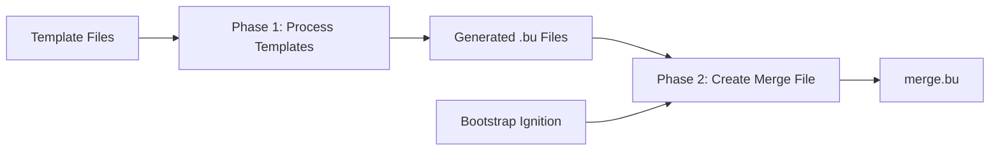

# Butane Ignition Merge Functionality

## Overview

This document explains how to merge multiple Ignition configurations using Butane templates, specifically in the context of the PSI-SNO OpenShift deployment project.

## Background: Multiple Ignition Configurations

### Can you embed multiple Ignition files into an ISO?

**No**, you cannot directly embed multiple separate Ignition files into a single ISO using the `coreos-installer` command. The tool is designed to embed **one** Ignition configuration that the live environment will use when it boots.

However, you can achieve the same result by **merging** your configurations into a single file *before* embedding it. The recommended way to do this is with Butane.

### Butane Merge Capability

A top-level Butane file can use the `merge` key to combine other Butane or Ignition configuration files. When you transpile this main file, Butane produces a single, consolidated Ignition file containing all the specified configurations.

## PSI-SNO Implementation

### Architecture

The PSI-SNO project implements a **two-phase Butane template processing workflow**:

1. **Phase 1**: Process individual configuration templates → Generate `.bu` files
2. **Phase 2**: Process merge template → Combine bootstrap + all configurations

### Template Structure

```
configs/openshift/machine-configs/butane/
├── 90-custom-dns.bu.j2      # DNS configuration (Jinja2 template)
├── 99-master-chrony.bu.j2   # Time synchronization (Jinja2 template)
└── merge.bu.j2               # Merge template (Jinja2 template)
```

### Merge Template Implementation

The `merge.bu.j2` template uses Jinja2 loops to dynamically include all generated configurations:

```yaml
# merge.bu.j2
variant: openshift
version: 4.18.0
ignition:
  config:
    merge:
      - source: file://{{ metadata_location }}/bootstrap-in-place-for-live-iso.ign

      - local: {{ bu_file }}

```

### Processing Workflow



**Detailed Steps:**

1. **Find Templates**: Scan `configs/openshift/machine-configs/butane/*.bu.j2`
2. **Separate Processing**:
   - Regular templates (e.g., `90-custom-dns.bu.j2`)
   - Merge templates (e.g., `merge.bu.j2`)
3. **Process Regular Templates**: Generate individual `.bu` files in project directory
4. **Scan Generated Files**: Create `butane_files` list from generated `.bu` files
5. **Process Merge Template**: Use `butane_files` variable to create dynamic references
6. **Result**: Single `merge.bu` file that references bootstrap + all configurations

### Example Output

After processing, the project directory contains:

```
build/projects/psi-example/
├── bootstrap-in-place-for-live-iso.ign  # OpenShift bootstrap ignition
├── 90-custom-dns.bu                     # DNS configuration
├── 99-master-chrony.bu                  # Time sync configuration
├── merge.bu                             # Combined configuration
└── rhcos-live-psi-example.iso           # Final ISO
```

The generated `merge.bu` file:

```yaml
# merge.bu (generated)
variant: openshift
version: 4.18.0
ignition:
  config:
    merge:
      - source: file:///path/to/project/bootstrap-in-place-for-live-iso.ign
      - local: 90-custom-dns.bu
      - local: 99-master-chrony.bu
```

## Template Variables and Requirements

### Required Variables

- **`metadata_location`**: Path to project directory containing bootstrap ignition file
- **`butane_files`**: List of generated `.bu` filenames (set dynamically)
- **Template-specific variables**:
  - `dns_fip` for DNS templates
  - Other configuration-specific variables

### Variable Validation

**Problem**: Butane does not process template variables like `{{ dns_fip }}`. If variables are not resolved, they will appear as literal text in the generated configuration.

**Solution**: Ensure all variables are defined and accessible when templates are processed:

```yaml
# ❌ Wrong - results in literal text:
dns={{ dns_fip }}

# ✅ Correct - variable resolved during template processing:
dns=10.0.108.151
```

## Usage Examples

### Manual Template Processing

```bash
# Process individual template
ansible localhost -m template \
  -a "src=configs/openshift/machine-configs/butane/90-custom-dns.bu.j2 dest=./90-custom-dns.bu" \
  -e "dns_fip=10.0.108.151"

# Process merge template with file list
ansible localhost -m template \
  -a "src=configs/openshift/machine-configs/butane/merge.bu.j2 dest=./merge.bu" \
  -e "metadata_location=$(pwd)" \
  -e '{"butane_files": ["90-custom-dns.bu", "99-master-chrony.bu"]}'
```

### Automated Processing via Role

```bash
# Full ISO creation (includes Butane processing)
make create-iso

# Just Butane template processing
ansible-playbook playbooks/gen-machineconfig.yml
```

## Best Practices

### Template Organization

1. **Use descriptive names**: `90-custom-dns.bu.j2` (priority + function)
2. **Separate concerns**: One configuration type per template
3. **Use merge template**: For combining multiple configurations

### Variable Management

1. **Define all variables**: Ensure variables are accessible during processing
2. **Test templates**: Verify generated content before deployment
3. **Use defaults**: Provide fallback values where appropriate

### Error Handling

1. **Validate templates**: Check Jinja2 syntax before deployment
2. **Monitor processing**: Watch for undefined variable warnings
3. **Test merge results**: Verify final merge.bu contains expected content

## Troubleshooting

### Common Issues

**Template not found errors:**
- Verify template path: `configs/openshift/machine-configs/butane/`
- Check filename pattern: `*.bu.j2`

**Undefined variable errors:**
- Ensure all template variables are defined
- Check variable scope and accessibility

**Recursive template errors:**
- Avoid self-referential variable definitions
- Check for circular dependencies in merge logic

**Empty or invalid merge files:**
- Verify `butane_files` variable is populated
- Check that `.bu` files exist before merge processing

### Debugging Tips

```bash
# Check generated files
ls -la build/projects/*/

# Verify template variables
ansible-playbook -vvv playbooks/gen-machineconfig.yml

# Test individual template
ansible localhost -m template -a "src=template.j2 dest=output.bu" -e "var=value"
```

## References

- [Butane Documentation](https://github.com/coreos/butane)
- [Fedora CoreOS Ignition](https://docs.fedoraproject.org/en-US/fedora-coreos/producing-ign/)
- [OpenShift Machine Configurations](https://docs.openshift.com/container-platform/latest/post_installation_configuration/machine-configuration-tasks.html)