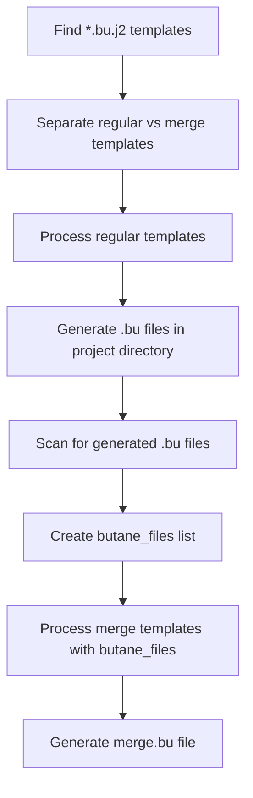

OpenShift ISO Builder Role
=========================

This role handles OpenShift ISO creation and machine configuration generation for OpenShift deployments.

Features
--------

- ISO creation for OpenShift deployments
- **Two-phase Butane template processing** for machine configurations
- Ignition config generation from Butane templates
- **Merge template functionality** for combining multiple configurations
- Dynamic file discovery and processing

Requirements
------------

- Ansible 2.9+
- `butane` executable (for machine config generation) - **Required for machineconfig functionality**
- Access to OpenShift installation files

### Installing Butane

The `butane` executable is required for machine configuration generation. To install:

1. **Download from GitHub releases:**
   ```bash
   sudo wget -O /usr/local/bin/butane https://github.com/coreos/butane/releases/download/v0.19.0/butane-x86_64-unknown-linux-gnu
   sudo chmod +x /usr/local/bin/butane
   ```

2. **Install via package manager (if available in your distribution)**

3. **Build from source:** https://github.com/coreos/butane

For RHEL/CentOS systems, butane might be available in OpenShift-related repositories.

Role Variables
--------------

### Default Variables (defaults/main.yml)

- `butane_templates_dir`: Directory containing Butane template files (.j2)
  - Default: `{{ (playbook_dir ~ '/../configs/openshift/machine-configs/butane') | realpath }}`
- `ignition_output_dir`: Output directory for generated Ignition configs
  - Default: `{{ (playbook_dir ~ '/../build/generated') | realpath }}`
- `butane_executable`: Path or name of the butane executable
  - Default: `butane`

### ISO Creation Variables

- `metadata_location`: Project directory containing bootstrap ignition file
- `project_build_dir`: Base directory for project artifacts
- `project_name`: Name of the current project (derived from metadata)

### Template Processing Variables

- `butane_files`: List of generated .bu filenames (set dynamically)
- `regular_templates`: Templates processed in first phase (excludes merge templates)
- `merge_templates`: Templates processed in second phase (includes merge.bu.j2)

Tags
----

This role supports the following tags:

- `make_iso`: Run only ISO creation tasks
- `machineconfig` or `gen_machineconfig`: Run only machine configuration generation tasks

Example Playbook
----------------

```yaml
- hosts: localhost
  gather_facts: false
  roles:
    - role: openshift/iso-builder
      tags:
        - make_iso
        - machineconfig
```

To run only specific functionality:

```bash
# Run only ISO creation
ansible-playbook playbook.yml --tags make_iso

# Run only machine config generation
ansible-playbook playbook.yml --tags machineconfig

# Run both (default)
ansible-playbook playbook.yml
```

Dependencies
------------

None

Implementation Notes
--------------------

**Important Ansible Limitations:**

1. **`loop` + `block`**: The `loop` construct cannot be used with `block` in Ansible. When you need to loop over a block of tasks, you must:
   - Move the block content into a separate task file
   - Use `include_tasks` with the loop to call the separate task file
   - Use `loop_control` with `loop_var` to rename the loop variable for clarity

2. **`delegate_to` + `include_tasks`**: The `delegate_to` directive cannot be used with `include_tasks`. Instead:
   - Place `delegate_to` on the individual tasks within the included file
   - Do NOT place `delegate_to` on the `include_tasks` directive itself

This implementation follows this pattern:
- `gen_machineconfig.yml` - Main task file that loops over template files
- `process_single_template.yml` - Separate task file that processes each individual template
- `make_iso.yml` - ISO creation with integrated Butane template processing

## Butane Template Processing Workflow

### Overview

The role implements a **two-phase processing workflow** for Butane templates:

1. **Phase 1**: Process regular templates → Generate `.bu` files
2. **Phase 2**: Process merge templates → Generate `merge.bu` with dynamic file references

### Template Structure

Templates are located in `configs/openshift/machine-configs/butane/`:

```
configs/openshift/machine-configs/butane/
├── 90-custom-dns.bu.j2      # DNS configuration template
├── 99-master-chrony.bu.j2   # Time sync configuration template
└── merge.bu.j2               # Merge template (combines all configs)
```

### Processing Flow



### Example Output

After processing, the project directory contains:

```
build/projects/psi-example/
├── bootstrap-in-place-for-live-iso.ign  # Bootstrap ignition
├── 90-custom-dns.bu                     # Generated from template
├── 99-master-chrony.bu                  # Generated from template
├── merge.bu                             # Generated merge file
└── rhcos-live-psi-example.iso           # Final ISO with embedded configs
```

### Merge Template Example

The `merge.bu.j2` template dynamically includes all generated configurations:

```yaml
# merge.bu
variant: openshift
version: 4.18.0
ignition:
  config:
    merge:
      - source: file://{{ metadata_location }}/bootstrap-in-place-for-live-iso.ign

      - local: {{ bu_file }}

```

Generates:

```yaml
# merge.bu (after processing)
variant: openshift
version: 4.18.0
ignition:
  config:
    merge:
      - source: file:///path/to/project/bootstrap-in-place-for-live-iso.ign
      - local: 90-custom-dns.bu
      - local: 99-master-chrony.bu
```

License
-------

PSI Project License

Author Information
------------------

PSI-SNO OpenShift Deployment Project
